# 📝 NotePad — Modern Note-Taking App

**NotePad** is a modern Android application built with **Kotlin**, **Jetpack Compose**, and the **MVVM** architecture.  
It provides a clean, fast, and intuitive experience for creating, organizing, and personalizing your notes and checklists.

---

## 🚀 Features

- 🗒️ **Notes & Checklists** — Create, edit, and manage your notes and to-dos easily.
- ⭐ **Favorites** — Mark important notes for quick access.
- 🗑️ **Delete & Restore** — Soft-delete and restore notes anytime.
- 🔍 **Search** — Real-time search across notes.
- 🌍 **Multi-Language Support** — Switch languages dynamically (includes full RTL for Persian & Arabic).
- 🌗 **Dark & Light Mode** — Choose between System, Dark, or Light themes.
- 🔎 **Dynamic Text Zoom** — Change text size via buttons or pinch gestures.
- 🎨 **Modern UI** — Clean, responsive design built entirely with Jetpack Compose.

---

## 📸 Screenshots

|  |  |
| :------------------------------: | :------------------------------: |
| 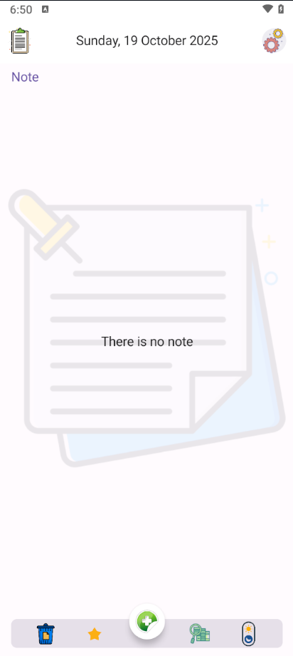 | 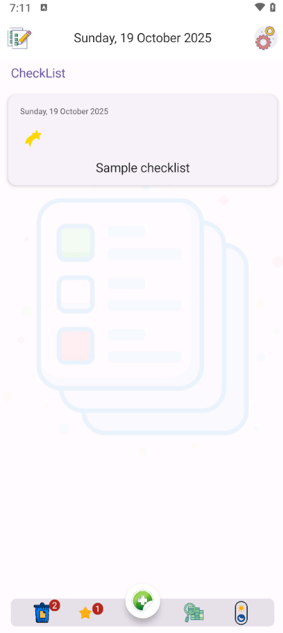 |
| 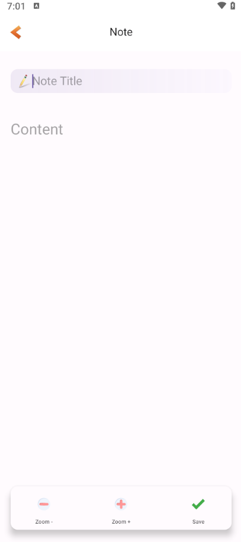 | 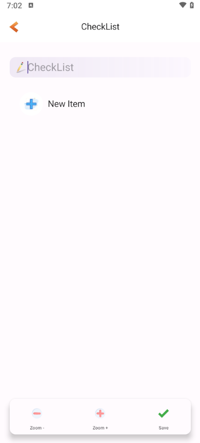 |
| 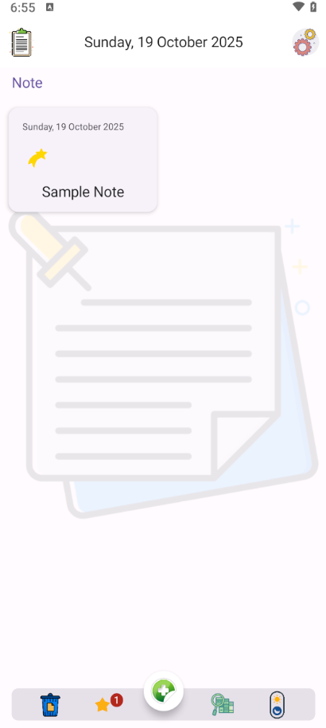 | 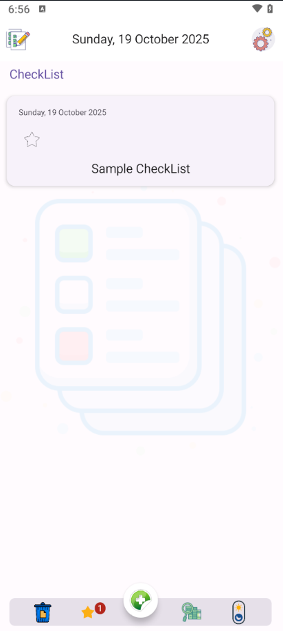 |
| 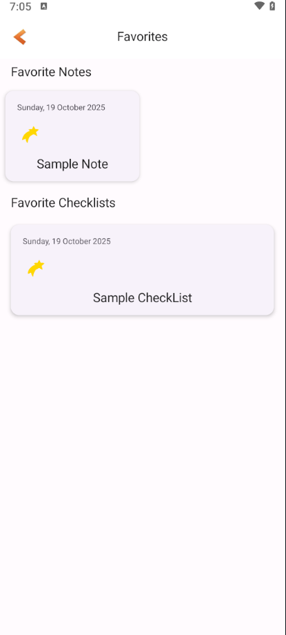 | 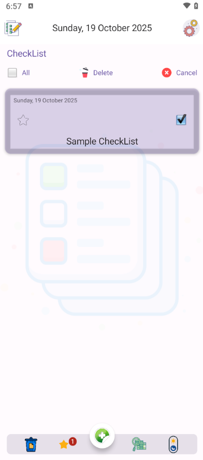 |
| 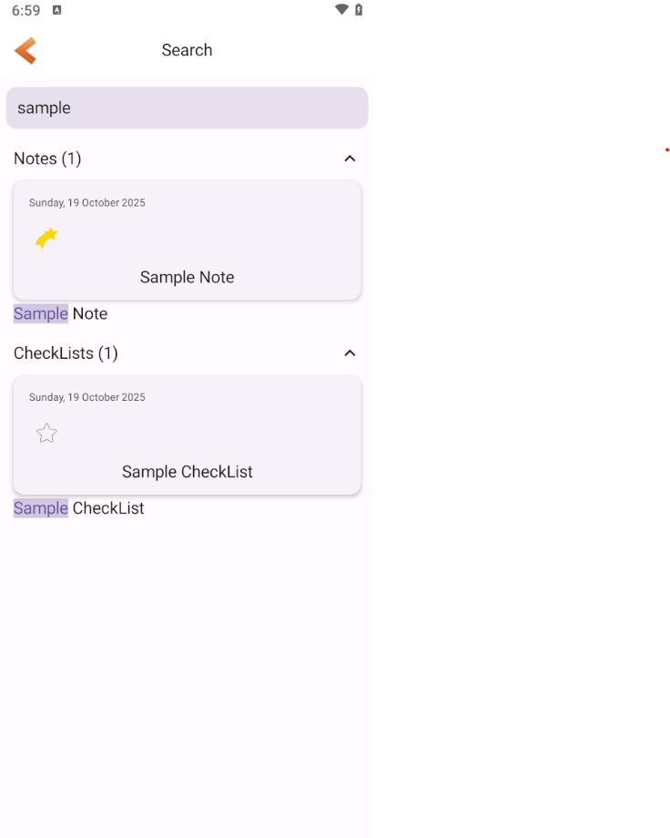 | 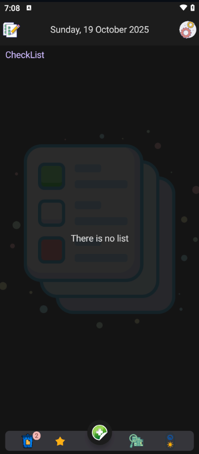 |
| 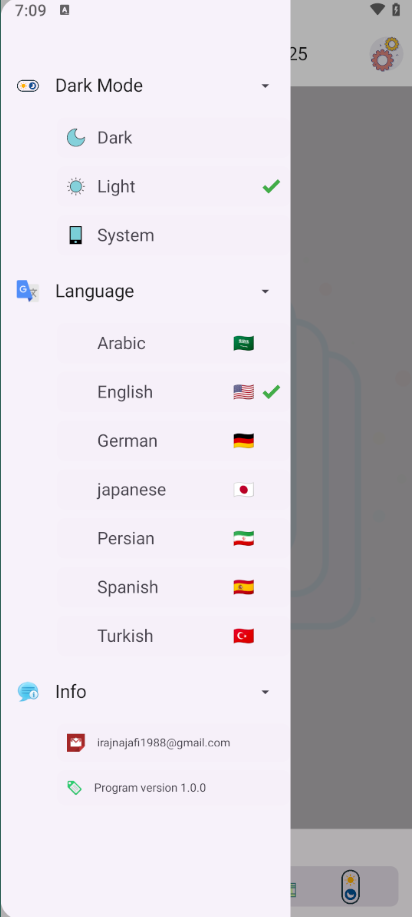 | 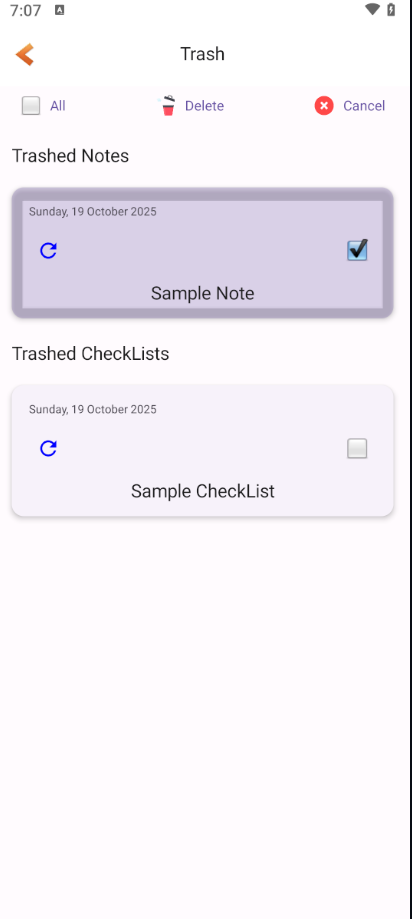 |
| 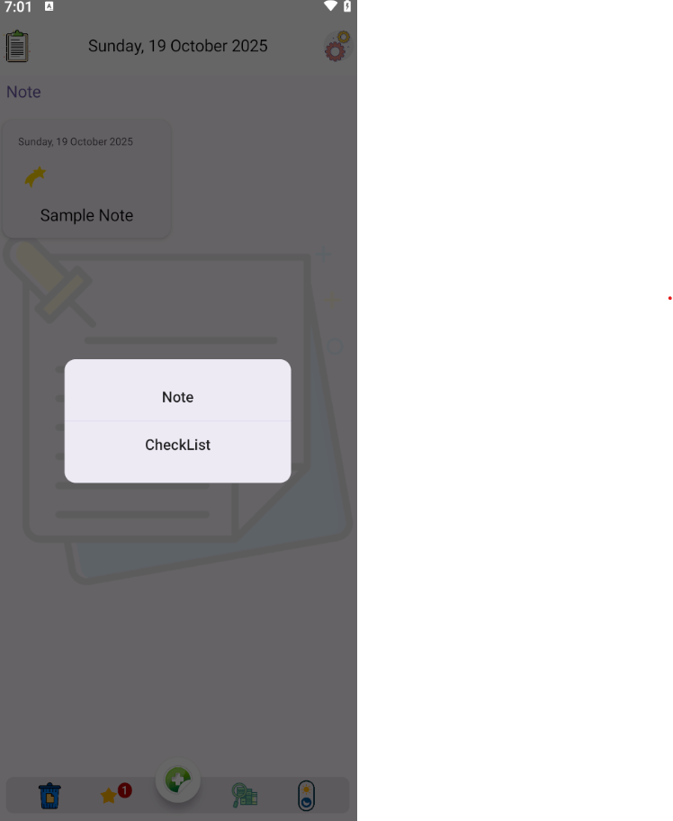 | 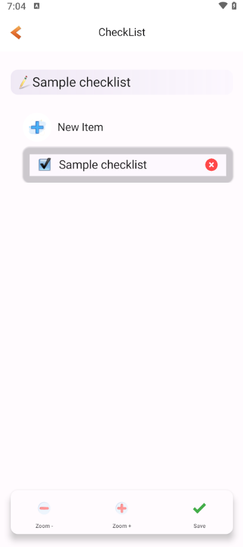 |

---

## 🛠️ Tech Stack

- **Language:** Kotlin
- **UI:** Jetpack Compose
- **Navigation:** Compose Navigation
- **Dependency Injection:** Hilt
- **Local Storage:** Room Database + DataStore
- **Asynchronous:** Kotlin Coroutines
- **Architecture:** MVVM

---

## ⚙️ Setup

1. **Clone this repository:**
   ```bash
   git clone https://github.com/IrajNajafi/NotePad.git
